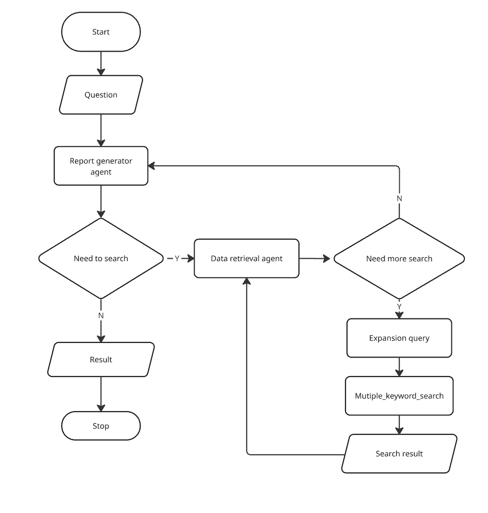
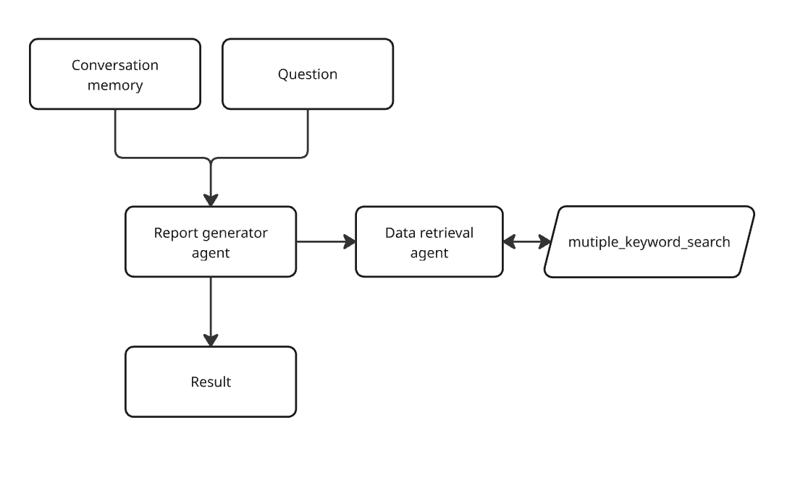
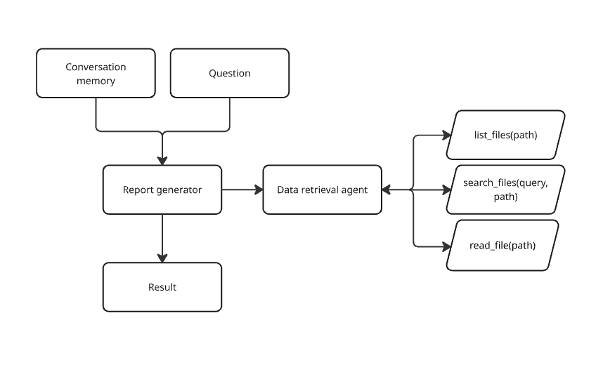

# Agentic AI RAG System

A simple two-agent RAG system built with **LangGraph**.

The system consists of:

* **Report Generator Agent** — receives the user's question and produces the final response.
* **Data Retrieval Agent** — retrieves relevant information from `knowledge_base.txt`.
* **`multiple_keyword_search` tool** — currently returns deterministic mock evidence through the same contract intended for local knowledge-base retrieval.

The project demonstrates multi-agent orchestration, custom RAG retrieval, tool calling, and prompt design.

The current implementation is a runnable mock workflow: graph routing and shared-state artifacts are wired end to end, while model calls and knowledge-base retrieval remain deterministic placeholders for later integration.

Tool-call routing follows each agent's own state memory so report and retrieval tool calls reach the correct next node.

---

## System Architecture and Flowchart

The Report Generator acts as the main agent. When additional information is required, it delegates retrieval to the Data Retrieval Agent.

The Data Retrieval Agent can expand the search query and call `multiple_keyword_search` multiple times until sufficient evidence is found.



---

## Graph Engineer 

LangGraph is used to control the workflow between the two agents.

The retrieval process can loop when the Data Retrieval Agent determines that more information is required. Once sufficient evidence has been retrieved, the result is returned to the Report Generator to generate the final response.



---

## Ideal Graph Design

In a real-world implementation, I would likely prefer a **grep-based / file-based RAG approach** for this use case. Recent research suggests that it can outperform traditional vector retrieval in several scenarios, especially when the searchable knowledge base is relatively small and well-structured.

Even when using a vector database, I believe each vector store should remain **small and domain-specific**. Instead of placing all knowledge into one large index, the data should be separated by category or domain, with the agent selecting the appropriate retrieval tool when needed. This reduces unnecessary search space, retrieval latency, and irrelevant context.

However, since this is an assignment, I kept this as an **ideal design** and implemented only the retrieval approach required by the assignment.


---

## Planned Retrieval Approach

The system uses a lightweight custom RAG mechanism instead of a vector database.

The Data Retrieval Agent:

1. Interprets the user's question.
2. Generates or expands relevant search keywords.
3. Calls `multiple_keyword_search`.
4. Reviews the retrieved snippets.
5. Performs another search if the available evidence is insufficient.
6. Returns relevant raw snippets to the Report Generator.

The retrieval tool searches sections inside `knowledge_base.txt`, ranks matching sections, removes duplicate results, and passes unique raw retrieval artifacts to the summary agent alongside the retrieval summary.

If no supporting information is available, the system avoids generating unsupported facts.

---

## Planned Reliability & Safety Handling

- **Ambiguous queries:** The agent asks a clarifying question when the user's intent is unclear.
- **No relevant information:** If no supporting evidence is found, the agent clearly states that the knowledge base does not contain enough information.
- **Out-of-scope queries:** Questions unrelated to the configured knowledge domain are politely declined.
- **System or retrieval errors:** If an error occurs, the system returns an error code and informs the user that the requested information could not be retrieved.

---

## Project Structure 

```text
.
├── assets/
│   ├── flowchart.png
│   └── graph_design.png
│   └── ideal_design.png
│
├── screenshots/
│   ├── query_01.png
│   ├── query_02.png
│   └── query_03.png
│
├── src/
│   ├── main.py
│   ├── graph.py
│   ├── agents/
│   │   ├── report_generator.py
│   │   └── data_retriever.py
│   └── tools/
│       └── multiple_keyword_search.py
│
├── knowledge_base.txt
├── requirements.txt
├── .env.example
└── README.md
```

---

## Knowledge Base

`knowledge_base.txt` is the local source of truth used by the retrieval system.

Example:

```text
[SECTION: International Travel Policy]

Employees travelling internationally must obtain manager approval
before booking flights.

---

[SECTION: Travel Expense Policy]

Approved airfare, accommodation, transportation, and meals may be
reimbursed for approved business travel.

---

[SECTION: Remote Work Policy]

Employees may work remotely for up to two days per week.
```

---

## Setup

### 1. Clone the repository

### 2. Create a virtual environment

### 3. Install dependencies

### 4. Configure environment variables

Copy `.env.example` to `.env` and provide the required API credentials.

```env
GROQ_API_KEY=YOUR_GROQ_API_KEY
```

Groq credentials are read from the environment and must not be committed to the repository.

---

## Run

```bash
python -m src.main
```

The retrieval tool imports the shared graph state only for type checking, avoiding a runtime circular import during application startup.

`search_tool` accepts LangChain-normalized AI tool calls in `GraphState` and returns the retrieval result as a `ToolMessage`.

Example question:

```text
What is the policy on international travel?
```

---

## Example Results

### Query 01


### Query 02


### Query 03


---

## Tech Stack

* Python
* LangGraph
* LangChain
* OpenAI-compatible LLM API
* Local text-based knowledge base
